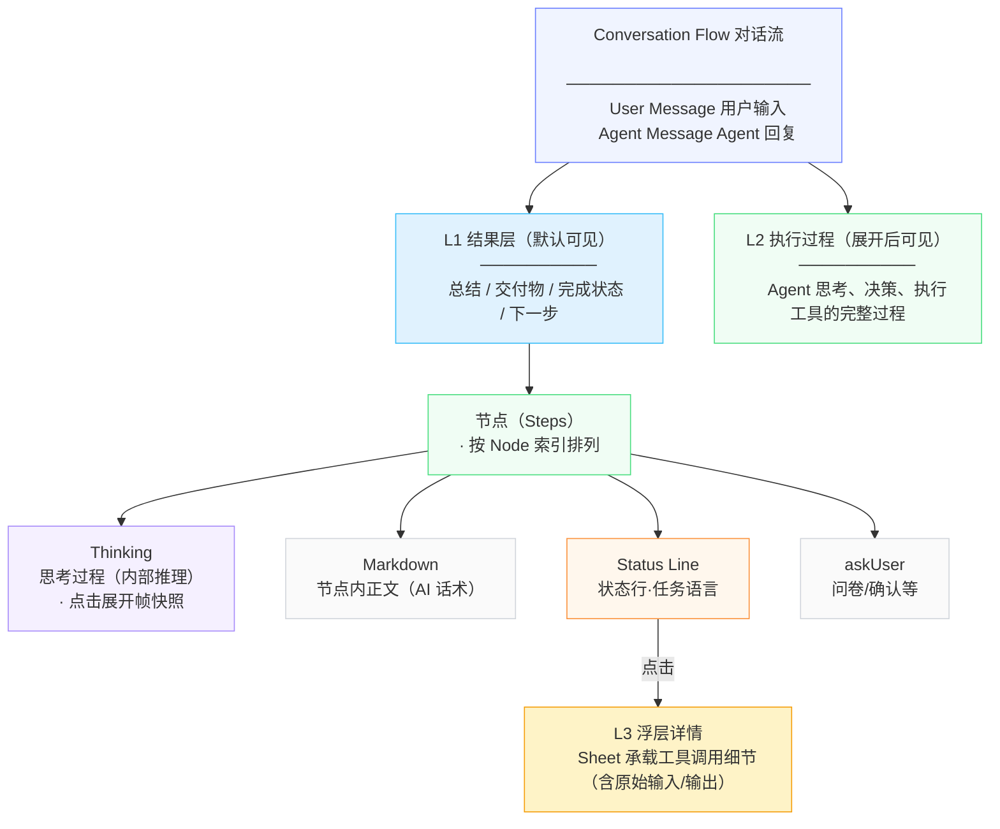

# 信息架构

## 对话流信息层级结构



> **思考过程（Thinking）是节点内的组件，不是平行叙事线。** 每个节点内都可能包含思考——Agent 理解任务时思考、遇到错误时重新规划思考、在工具调用之间反复推理。思考过程与 Markdown、Status Line、askUser 等同属于节点内的内容组成部分。

---

## 三层披露体系

从用户视角看，对话流的信息按三层披露组织，从浅到深逐级下钻：

| 层级 | 位置 | 内容 | 语言风格 | 面向用户 |
|------|------|------|----------|----------|
| **第一层披露：执行结果** | 主对话流，默认可见 | 总结、交付物、完成状态、下一步 | 产品化结论 | 结果型用户 |
| **第二层披露：执行过程** | 展开执行过程后可见 | 执行节点（节点内的全部内容：思考过程 + Markdown + 状态行 + askUser），**能看到 AI 在想什么、说了什么、调用了什么工具** | 任务语言 | 审核型用户 |
| **第三层披露：工具调用** | 点击某条状态行后弹出 Sheet | 具体工具调用的内容及原始细节：**搜索了什么 URL、返回了什么结果、生成了什么图片、执行了什么命令、完整输入/输出、API 响应、exit code 等** | 结构化摘要 → 原始细节 | 审核型 / 较真型用户 |

---

## 两阶段视图切换

同一个 Agent Run，在不同时态下主角不同：

```
执行过程态（运行时）          结果交付态（完成后）
─────────────────            ─────────────────
主角：过程信息               主角：结果信息
可见：第二层披露：执行过程       可见：第一层披露：执行结果
折叠：结果（尚未产出）        折叠：第二层披露：执行过程（降级为追溯入口）
```

**运行中过程浮在前面，完成后结果浮在前面，第二层披露：执行过程降级为追溯入口。**

