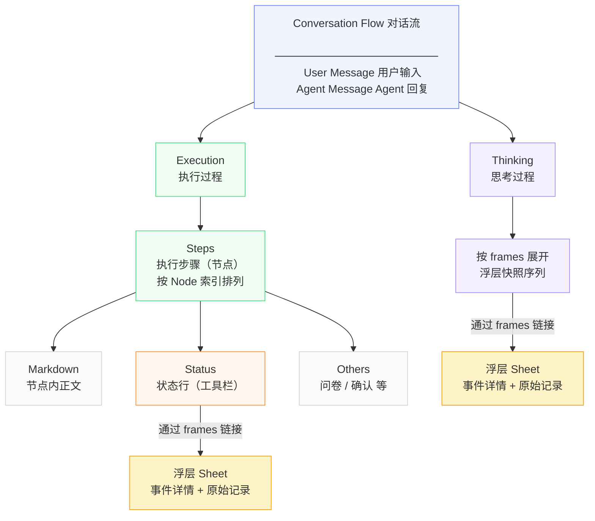

# 信息架构

## 对话流信息层级结构



---

## 四层信息层级

从用户视角看，对话流的信息按四层组织，从浅到深逐级下钻：

| 层级           | 位置        | 内容                  | 语言风格  | 面向用户           |
| ------------ | --------- | ------------------- | ----- | -------------- |
| **L0 结果层**   | 主对话流，默认可见 | 总结、交付物、完成状态、下一步     | 产品化结论 | 结果型用户          |
| **L1 节点层**   | 展开执行过程后可见 | 执行阶段标题列表，各阶段完成状态    | 任务语言  | 审核型用户          |
| **L2 状态行层**  | 节点内平铺，可点击 | 每个动作的摘要入口，告诉用户发生了什么 | 任务语言  | 审核型用户          |
| **L3 浮层详情层** | 点击状态行后弹出  | 工具调用、命令执行、错误原文、原始输出 | 原始细节  | 较真型 / Debug 用户 |

---

## 两阶段视图切换

同一个 Agent Run，在不同时态下主角不同：

```
执行过程态（运行时）          结果交付态（完成后）
─────────────────            ─────────────────
主角：过程信息               主角：结果信息
可见：节点 + 状态行          可见：总结 + 交付物
折叠：结果（尚未产出）       折叠：执行过程（降级为追溯入口）
```

**核心规则**：运行中，过程浮在前面；完成后，结果浮在前面，执行过程折叠为"执行过程 · 19m40s"入口，用户按需展开追溯。

---

## 追溯路径

用户从结果出发，可逐级下钻到原始记录：

```
L0 结果层（默认可见）
  ↓ 点击「执行过程 · 19m40s」
L1 节点层（执行阶段列表）
  ↓ 节点内直接平铺
L2 状态行层（动作摘要，任务语言）
  ↓ 点击某条状态行
L3 浮层详情层（原始细节，工具名 / 命令 / 错误原文）
  ↓ 关闭浮层
回到对话流原位
```

**快照语义**：点击已完成的状态行，浮层展示的是该动作完成时刻的信息切片，不累积其他状态行的内容。
