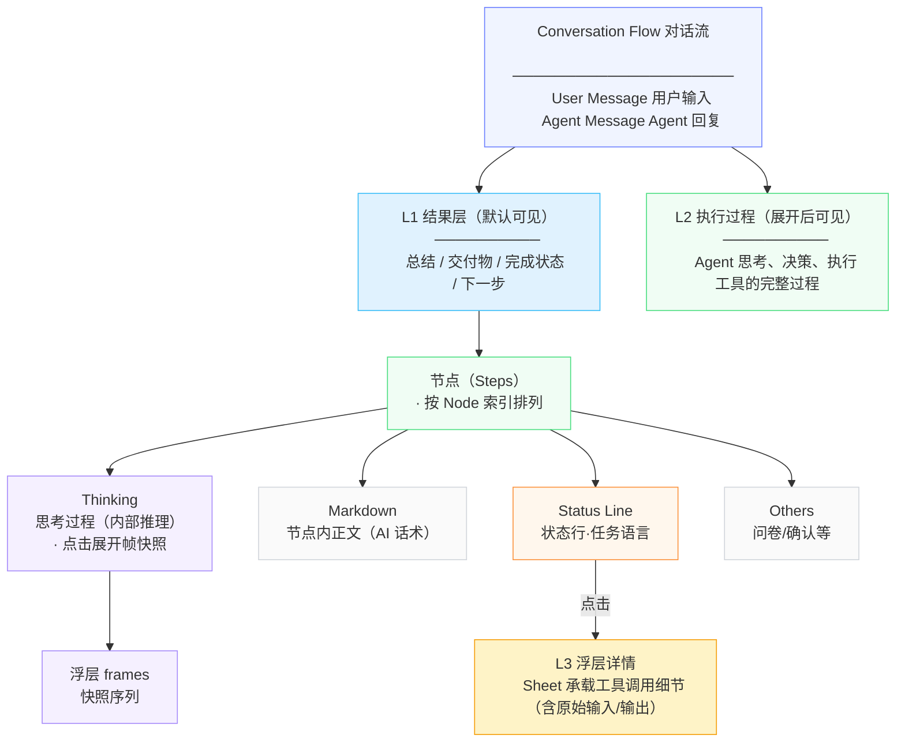

# 信息架构

## 对话流信息层级结构



> **思考过程（Thinking）是节点内的组件，不是平行叙事线。** 每个节点内都可能包含思考——Agent 理解任务时思考、遇到错误时重新规划思考、在工具调用之间反复推理。思考过程与 Markdown、Status Line、问卷/确认等同属于节点内的内容组成部分。

---

## 三层披露体系

从用户视角看，对话流的信息按三层披露组织，从浅到深逐级下钻：

| 层级 | 位置 | 内容 | 语言风格 | 面向用户 |
|------|------|------|----------|----------|
| **第一层披露：执行结果** | 主对话流，默认可见 | 总结、交付物、完成状态、下一步 | 产品化结论 | 结果型用户 |
| **第二层披露：执行过程** | 展开执行过程后可见 | 执行节点（节点内的全部内容：思考过程 + AI 话术 + 状态行 + 问卷/确认），**能看到 AI 在想什么、说了什么、调用了什么工具** | 任务语言 | 审核型用户 |
| **第三层披露：工具调用** | 点击某条状态行后弹出 Sheet | 具体工具调用的内容及原始细节：**搜索了什么 URL、返回了什么结果、生成了什么图片、执行了什么命令、完整输入/输出、API 响应、exit code 等** | 结构化摘要 → 原始细节 | 审核型 / 较真型用户 |

---

## 两阶段视图切换

同一个 Agent Run，在不同时态下主角不同：

```
执行过程态（运行时）          结果交付态（完成后）
─────────────────            ─────────────────
主角：过程信息               主角：结果信息
可见：第二层披露：执行过程       可见：第一层披露：执行结果
折叠：结果（尚未产出）        折叠：第二层披露：执行过程（降级为追溯入口）
```

**核心规则**：运行中，过程浮在前面；完成后，结果浮在前面，执行过程折叠为"执行过程 · 19m40s"入口，用户按需展开追溯。

---

## 追溯路径

用户从结果出发，可逐级下钻到原始记录：

```
第一层披露：执行结果（默认可见）
  ↓ 点击「执行过程 · 19m40s」
第二层披露：执行过程
  · 节点标题：任务理解与分解
  · AI 话术：现在开始执行：先联网搜索签证/入境政策…
  · 状态行：搜索网页 · 正在搜索签证/入境政策、交通卡信息
  ↓ 点击某条状态行（如「搜索网页」）
第三层披露：工具调用（Sheet）
  · 具体搜索了什么 URL
  · 搜索结果的标题列表
  · 生成了什么图片的描述
  · 完整命令、输出、退出码、错误原文
  ↓ 关闭 Sheet
回到对话流原位
```

**快照语义**：点击已完成的状态行，浮层展示的是该动作完成时刻的信息切片，不累积其他状态行的内容。

---

## 各层示例对比

### 第二层披露：执行过程 — 用户可以看见什么

```
[节点] 任务理解与分解：明确需求、约束和输出格式
  ├── 为一家四口规划2026年9月关西7日旅行…（AI 话术）
  ├── [创建待办] ✓ （状态行，可点击）
  ├── 现在开始执行：先联网搜索签证/入境政策…（AI 话术）
  └── [搜索网页] 正在搜索签证/入境政策…（状态行，可点击）

[节点] 生成关西主要地点图片
  ├── 现在生成关西主要地点的图片：（AI 话术）
  ├── [生成图片] （状态行，可点击）
  └── [更新待办] ✓ （状态行，可点击）
```

### 第三层披露：工具调用 — Sheet 内内容结构

```
执行过程层 状态行 [执行命令] → 工具调用 Sheet 打开
├── 🖥️ 执行命令 · python3 -c "（摘要）
├── 🖥️ 执行命令 · cd /sessions/6a2189a4ac3de7…（摘要）
│   └── → 展开完整细节
│       ├── 输入命令：
│       │   python3 -c "import re ...
│       ├── 标准输出：
│       │   正在处理文件...
│       ├── 退出码：0
│       └── 错误输出：（无）
```

---

## Demo 实现对照

| 层级 | Demo 中的具体体现 |
|------|-------------------|
| 第一层披露：执行结果 | header 区域 + 结果 markdown + file card |
| 第二层披露：执行过程 | `nodes[]` 数组，每个 node 包含 `title`、`actions`（markdown + status + askUser） |
| 第二层披露·状态行（触发器） | `actions` 中 `type:"status"` 条目，显示为 `doneText "搜索网页"` + `dim` |
| 第三层披露：工具调用 | 点击状态行后 `openSheet(frameRefs)` 打开的 Sheet 弹窗，渲染 `events`（搜索网页的 outputs、执行命令的 events）；Sheet 内 `renderEvent` 中 `showChevron` 标记的行（`/执行命令/`），可进一步展开显示完整命令和输出 |
