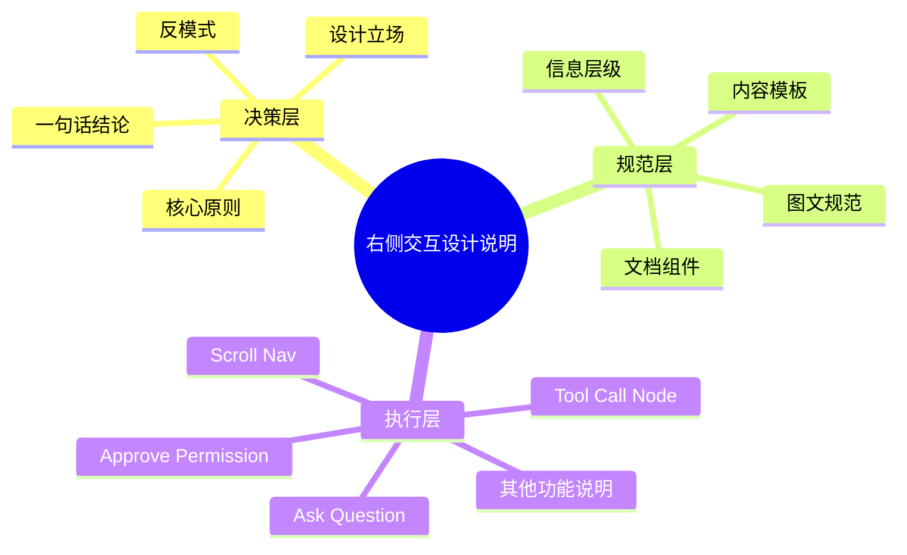
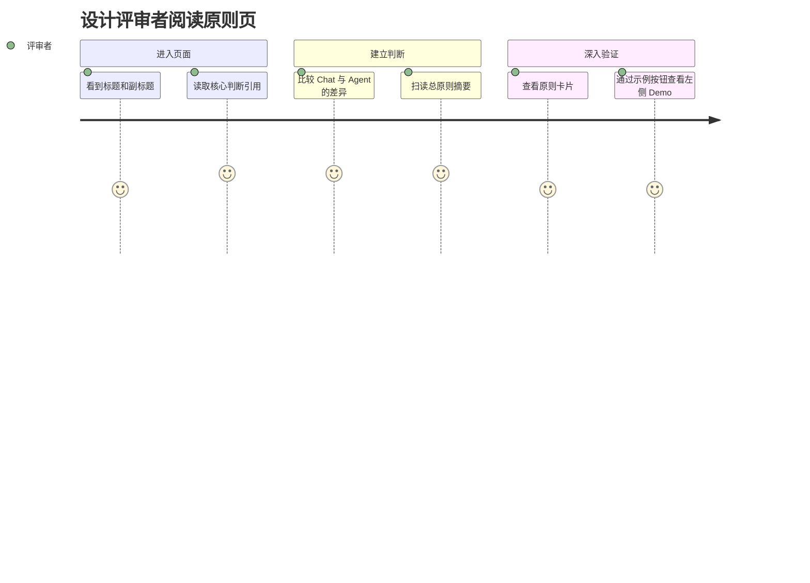
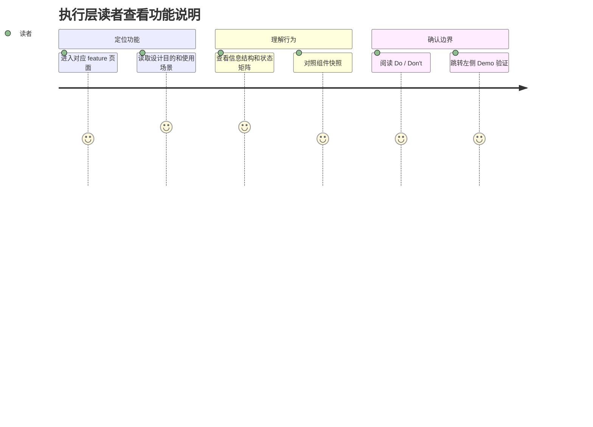

# EXPERIENCE.md: 右侧交互设计说明文档体验规范

## 0. Foundation

右侧 Feature Panel 是 Agent 产品设计的讲解空间。它不是研发实现说明，也不是单纯组件库展示。

它的核心任务是：定义如何把 Agent 产品设计讲清楚。

本文件规范右侧说明文档的阅读体验、信息架构、页面模板、状态说明方式和示例联动方式。视觉身份以 `DESIGN.md` 为准。

如果本文件、`DESIGN.md`、截图、临时 mock 或实现细节出现冲突，以 `DESIGN.md` 和 `EXPERIENCE.md` 这两根 spine 为准。

## 1. 文档定位与读者分层

右侧说明文档服务三类阅读深度：

| 层级 | 面向对象 | 目标 | 典型内容 |
|---|---|---|---|
| 决策层 | 设计团队决策层、设计同行、评审人 | 让对方理解为什么这样设计 | 设计立场、核心原则、反模式、判断依据 |
| 规范层 | 设计维护者、后续扩展者 | 定义说明文档如何组织 | 信息层级、内容模板、图文规范、组件使用规则 |
| 执行层 | 具体功能说明的撰写者和阅读者 | 说明每个功能点的设计细节与使用逻辑 | 功能目的、使用场景、状态变化、Do / Don't、示例 |

说明文档不要求所有读者从头读到尾。它必须支持快速扫读、结构阅读和深入评审。

## 2. Information Architecture

信息架构应保证三件事：

1. 决策层回答“为什么”。
2. 规范层回答“如何组织”。
3. 执行层回答“具体怎么用”。

## 3. Voice and Tone

说明文字应使用设计判断语言，而不是工程实现语言。

| 应该这样写 | 不要这样写 |
|---|---|
| 点击状态行后，读者进入更细一层的工具调用详情 | 绑定 click 事件后调用 openSheet |
| 这个模块用于让用户在关键风险点主动确认 | 这里渲染 permission 组件 |
| 运行中优先展示过程，完成后优先展示结果 | displayMode 从 running 切到 final |

语气规则：

- 先说设计目的，再说结构，再说行为。
- 避免堆技术名词。必要技术词必须服务用户理解。
- 不把 CSS、JS、文件路径当成主要说明对象。
- 允许出现功能名，但要解释它解决的体验问题。

## 4. 表达原则

### 4.1 先讲判断，再讲结构，最后讲细节

不直接从控件细节开始。读者需要先知道这个设计为什么存在，再理解它如何组织，最后才进入具体状态和行为。

### 4.2 图文并茂是默认要求

描述外观、行为、状态、流程时，不能只有纯文本。文字负责解释判断，图像负责降低理解成本。

| 内容类型 | 推荐表达 | 备注 |
|---|---|---|
| 设计原则 | 引用块、对比卡、反模式表格 | 可以文字为主，但必须有结构化视觉承载 |
| 信息架构 | Mermaid、层级表、流程图 | 优先展示层级关系 |
| 功能构成 | 组件快照、标注图、结构拆解表 | 说明“由什么组成” |
| 状态变化 | 状态矩阵、并排快照、流程图 | 说明“从什么变成什么” |
| Do / Don't | 两列对比、正反示例截图 | 不能只写抽象原则 |

### 4.3 不写工程实现逻辑

可以说明交互逻辑和产品规则，但不写具体工程实现路径。

例如：

- 可以写：点击状态行后进入详情层。
- 不写：在某个 JS 文件中绑定事件。

## 5. 页面模板

### 5.1 原则页模板

适用于“原则指南”这类决策层内容。

1. 标题：说明讨论对象。
2. 副标题：一句话定义问题范围。
3. 引用块：提出核心判断。
4. 对比卡：展示为什么需要新框架。
5. 总原则摘要：压缩成可记忆短句。
6. 原则卡片：逐条展开。
7. 反模式：说明不这么做会怎样。
8. 一句话结论：回收全页判断。

### 5.2 信息架构页模板

适用于“信息架构”这类规范层内容。

1. 标题和副标题。
2. 层级表：说明每一层面向谁、解决什么问题。
3. 结构图：展示层级关系。
4. 阶段切换：说明运行中和完成后的阅读主角变化。
5. 示例跳转：将结构规则映射到左侧 Demo。

### 5.3 功能说明页模板

适用于 Ask Question、Approve Permission、Tool Call Node、Scroll Nav 等执行层内容。

| 段落 | 必须回答的问题 |
|---|---|
| 设计目的 | 这个功能解决什么体验问题？ |
| 使用场景 | 用户在什么时候遇到它？ |
| 信息结构 | 它由哪些内容和层级组成？ |
| 默认状态 | 用户第一眼看到什么？ |
| 交互行为 | 点击、展开、确认、拒绝、跳转后发生什么？ |
| 状态变化 | 运行中、完成、失败、禁用、等待用户等状态如何表达？ |
| 示例 | 左侧 Demo 对应哪个状态？ |
| Do / Don't | 什么时候该用，什么时候不该用？ |

### 5.4 状态说明页模板

适用于 Tool Call Node 这类状态复杂模块。

1. 先给状态矩阵。
2. 再给状态切换路径。
3. 再展示典型状态快照。
4. 最后说明异常、失败、禁用、等待用户等边界状态。

## 6. Component Patterns

| 文档组件 | 行为角色 | 体验要求 | 视觉归属 |
|---|---|---|---|
| 页面标题 | 定义当前阅读主题 | 一眼知道本页讨论对象 | `DESIGN.md` 页面标题 |
| 副标题 | 缩小主题范围 | 用一句话解释“为什么要读这页” | `DESIGN.md` 副标题 |
| 引用块 | 放置核心判断 | 只承载判断，不承载复杂规范 | `DESIGN.md` 引用块 |
| 对比卡 | 帮读者理解取舍 | 字段少，关系强，适合横向比较 | `DESIGN.md` 对比卡 |
| 表格 | 承载规则矩阵 | 首列必须能扫读，单元格不写长段 | `DESIGN.md` 表格 |
| Mermaid 图 | 承载结构关系 | 用于流程、层级、状态迁移 | `DESIGN.md` Mermaid 图 |
| 组件快照 | 证明规则能落地 | 必须配说明文字，不能孤立展示 | `DESIGN.md` 组件快照 |
| 跳转按钮 | 连接右侧说明和左侧 Demo | 文案说明点击后“看到什么” | `DESIGN.md` 跳转按钮 |

## 7. State Patterns

右侧说明文档需要表达两类状态：

1. 文档阅读状态：读者正在扫读、结构阅读、深入评审。
2. 被说明对象状态：某个 Agent 功能在左侧 Demo 中的运行、完成、失败、等待用户等状态。

状态说明规则：

| 状态类型 | 推荐表达 |
|---|---|
| 默认状态 | 快照 + 一句话说明第一眼看到什么 |
| 运行中 | 状态矩阵 + 示例跳转 |
| 完成态 | 完成快照 + 结果/过程主次说明 |
| 失败态 | 失败影响 + 可追溯路径 + 是否可重试 |
| 等待用户 | 触发条件 + 用户可选动作 + 继续路径 |
| 禁用态 | 禁用原因 + 如何恢复 |

## 8. Interaction Primitives

### 8.1 和左侧 Demo 的关系

右侧说明区不是左侧 Demo 的控制台，但可以通过按钮把读者带到对应示例状态。

规则：

- 按钮文案说明“将看到什么”，不是说明“执行什么代码”。
- 示例跳转服务理解，不承担主导航职责。
- 右侧解释和左侧状态必须一一对应。不能出现右侧讲了但左侧没有示例的关键行为。

### 8.2 页面内阅读节奏

一页只解决一个主题。复杂内容拆成多页，不在单页内堆叠全部规范。

如果一个功能同时包含结构、状态、流程、视觉细节，应按“结构先于状态，状态先于细节”的顺序展开。

## 9. Accessibility Floor

右侧说明文档至少满足以下阅读可访问性要求：

| 项目 | 要求 |
|---|---|
| 标题层级 | h1 / h2 / h3 语义清晰，不跳级表达主要结构 |
| 表格 | 表头必须清楚，不能只依赖颜色区分列含义 |
| 图示 | 图示附近必须有文字解释，不能让图成为唯一信息来源 |
| 按钮 | 文案说明结果，不只写“查看”“跳转” |
| 对比 | 正反示例不能只靠红绿颜色区分 |
| 长内容 | 必须有摘要、表格或图示帮助扫读 |

视觉对比度和视觉 token 以 `DESIGN.md` 为准。

## 10. Key Flows

### 10.1 设计评审者快速理解设计立场

### 10.2 执行层读者查某个功能点

## 11. Do / Don't

| Do | Don't |
|---|---|
| 先写设计判断，再写组件细节 | 上来就描述按钮、颜色、边距 |
| 用图表承载结构关系 | 用纯文字描述复杂流程 |
| 把读者分成决策层、规范层、执行层 | 假设所有人都按同一种深度阅读 |
| 明确这是说明文档规范 | 把它写成 Agent 产品本体规范 |
| 说明交互逻辑 | 说明工程实现逻辑 |
| 用示例验证规则 | 只写抽象原则 |

## 12. Open Questions

1. 是否需要把 Agent 产品本身的 design.md 单独建档，以避免后续引用混淆？
2. 每个 feature 是否需要统一补齐“设计目的、使用场景、信息结构、状态变化、Do / Don't”模板？
3. 右侧说明区是否需要一个总览页，专门解释这套文档的三层阅读方式？
