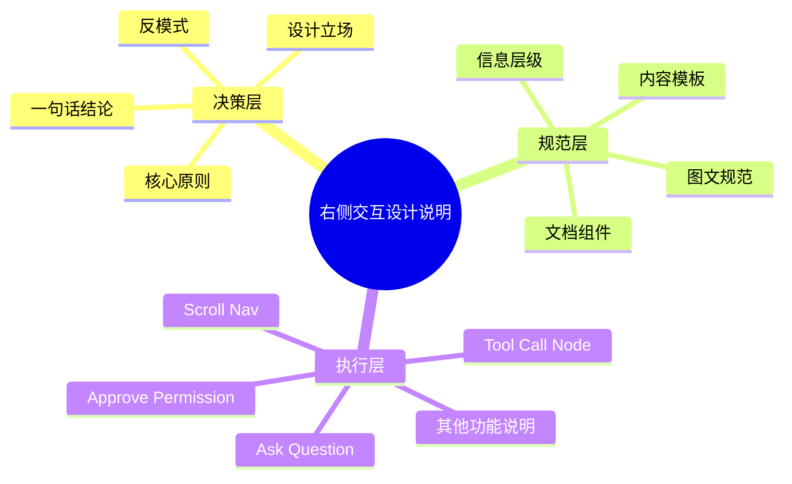

# 右侧交互设计说明文档 design.md

## 0. 绝对边界

这份 design.md 规范的是右侧 Feature Panel 作为“交互设计说明文档系统”的设计语言。它回答的问题是：如何把 Agent 产品设计讲清楚。

它不规范 Agent 产品本身。Agent 产品本身的设计规范应单独成文，关注左侧 Demo 所代表的 Agent 对话流、执行过程、权限确认、工具调用节点和交付验收体验。

| 文档 | 规范对象 | 关注问题 | 禁止混入 |
|---|---|---|---|
| 右侧交互设计说明文档 design.md | 设计说明文档的表达系统 | 读者分层、内容层级、说明模板、图文规范、文档组件 | Agent 产品本身如何工作 |
| Agent 产品 design.md | Agent 产品体验本身 | Agent 如何完成任务、如何透明、如何可控、如何验收 | 右侧说明文档的版式和阅读规范 |

当需求中出现“右侧说明区”“交互设计说明”“说明文档 design.md”“文档设计语言”时，默认进入本文件语境。

## 1. 文档定位

右侧 Feature Panel 是 Agent 产品设计的讲解空间。它不是研发实现说明，也不是单纯的组件库展示。它承担三层任务：

| 层级 | 面向对象 | 目标 | 典型内容 |
|---|---|---|---|
| 决策层 | 设计团队决策层、设计同行、评审人 | 让对方理解为什么这样设计 | 设计立场、核心原则、反模式、判断依据 |
| 规范层 | 设计维护者、后续扩展者 | 定义说明文档如何组织 | 信息层级、内容模板、图文规范、组件使用规则 |
| 执行层 | 具体功能说明的撰写者和阅读者 | 说明每个功能点的设计细节与使用逻辑 | 功能目的、使用场景、状态变化、Do / Don't、示例 |

## 2. 表达原则

### 2.1 先讲判断，再讲结构，最后讲细节

每个主题应按以下顺序组织：

不直接从控件细节开始。读者需要先知道这个设计为什么存在，再理解它如何组织，最后才进入具体状态和行为。

### 2.2 图文并茂是默认要求

描述外观、行为、状态、流程时，不能只有纯文本。文字负责解释判断，图像负责降低理解成本。

| 内容类型 | 推荐表达 | 备注 |
|---|---|---|
| 设计原则 | 引用块、对比卡、反模式表格 | 可以文字为主，但必须有结构化视觉承载 |
| 信息架构 | Mermaid、层级表、流程图 | 优先展示层级关系 |
| 功能构成 | 组件快照、标注图、结构拆解表 | 说明“由什么组成” |
| 状态变化 | 状态矩阵、并排快照、流程图 | 说明“从什么变成什么” |
| Do / Don't | 两列对比、正反示例截图 | 不能只写抽象原则 |

### 2.3 说明文档不写工程实现逻辑

可以说明交互逻辑和产品规则，但不写具体工程实现路径。比如可以写“点击状态行后进入详情层”，不写“在 engine/sheet.js 中绑定事件”。

## 3. 内容架构

信息架构应保证三件事：

1. 决策层回答“为什么”。
2. 规范层回答“如何组织”。
3. 执行层回答“具体怎么用”。

## 4. 视觉语言

### 4.1 基础气质

右侧说明区使用克制、编辑感、作品集式的视觉语言。目标不是制造强交互感，而是提升阅读可信度和设计表达的专业感。

关键词：克制、清晰、留白、结构化、可评审。

### 4.2 字体角色

| 角色 | Token | 用法 | 当前实现参考 |
|---|---|---|---|
| 大标题、二级标题 | `{typography.title-serif}` | 页面标题、章节标题、重要判断 | `h1`, `h2`, `.fp-section-label` |
| 正文 | `{typography.body-sans}` | 普通段落、列表、说明文字 | `.fp-root`, `.markdown-body` |
| 强调性短句 | `{typography.body-serif-emphasis}` | 原则摘要、对比卡中的关键值 | `.fp-principle-summary`, `.fp-compare-val` |
| 辅助标签 | `{typography.body-sans}` | tab、button、tag、表头 | 小字号、较高字距 |

规则：

- 衬线字体用于“判断”和“结论”，不用于大段解释。
- 无衬线字体用于“说明”和“操作”，保证长阅读效率。
- 同一段内容内不要随意混用字体。字体变化必须对应信息角色变化。

### 4.3 色彩角色

| Token | 用途 |
|---|---|
| `{colors.ink-primary}` | 标题、核心文字 |
| `{colors.ink-body}` | 正文主文字 |
| `{colors.ink-secondary}` | 副标题、说明、弱化信息 |
| `{colors.ink-muted}` | 标签、表头、元信息 |
| `{colors.surface-document}` | 文档主体背景 |
| `{colors.surface-soft}` | 表格隔行、轻量背景 |
| `{colors.surface-inverse}` | 高亮原则块、反向强调块 |
| `{colors.border-subtle}` | 分割线、轻量卡片边界 |

色彩不承担装饰任务。它主要用于层级、分组和强调。

### 4.4 形状与边界

默认圆角为 `{rounded.DEFAULT}`，也就是 0。右侧说明区不使用大圆角卡片语言，避免和左侧手机 Demo 的产品界面语言混淆。

圆形只用于编号、状态点等语义明确的小元素。

## 5. 文档组件规范

| 组件 | 使用场景 | 设计规则 | 不要这样用 |
|---|---|---|---|
| 页面标题 | 每个 feature 的开头 | 用衬线字体，表达主题，不写成长句 | 不要把标题写成操作说明 |
| 副标题 | 标题下方一句话解释 | 用无衬线正文，说明本页讨论对象 | 不要堆多个判断 |
| 引用块 | 放置设计立场或核心判断 | 适合承载“为什么” | 不要放列表型规范 |
| 对比卡 | 对比两种模式或设计取舍 | 左右关系清晰，字段数量克制 | 不要做成普通信息卡 |
| 原则摘要 | 汇总一组原则 | 短句、可记忆、强节奏 | 不要写成长段说明 |
| 表格 | 展示层级、状态、规则矩阵 | 字段明确，适合横向比较 | 不要把长段落塞进单元格 |
| Mermaid 图 | 展示流程、层级、状态迁移 | 用于结构关系，不用于装饰 | 不要替代所有解释文字 |
| 组件快照 | 展示具体功能点样貌 | 必须和说明文字配合 | 不要只放截图不解释 |
| Do / Don't | 说明边界和反模式 | 必须正反并置 | 不要只列抽象口号 |
| 跳转按钮 | 将说明和左侧 Demo 状态连接 | 文案说明点击后看到什么 | 不要变成普通导航按钮 |

## 6. 页面模板

### 6.1 原则页模板

适用于“原则指南”这类决策层内容。

1. 标题：说明讨论对象。
2. 副标题：一句话定义问题范围。
3. 引用块：提出核心判断。
4. 对比卡：展示为什么需要新框架。
5. 总原则摘要：压缩成可记忆短句。
6. 原则卡片：逐条展开。
7. 反模式：说明不这么做会怎样。
8. 一句话结论：回收全页判断。

### 6.2 信息架构页模板

适用于“信息架构”这类规范层内容。

1. 标题和副标题。
2. 层级表：说明每一层面向谁、解决什么问题。
3. 结构图：展示层级关系。
4. 阶段切换：说明运行中和完成后的阅读主角变化。
5. 示例跳转：将结构规则映射到左侧 Demo。

### 6.3 功能说明页模板

适用于 Ask Question、Approve Permission、Tool Call Node、Scroll Nav 等执行层内容。

| 段落 | 必须回答的问题 |
|---|---|
| 设计目的 | 这个功能解决什么体验问题？ |
| 使用场景 | 用户在什么时候遇到它？ |
| 信息结构 | 它由哪些内容和层级组成？ |
| 默认状态 | 用户第一眼看到什么？ |
| 交互行为 | 点击、展开、确认、拒绝、跳转后发生什么？ |
| 状态变化 | 运行中、完成、失败、禁用、等待用户等状态如何表达？ |
| 示例 | 左侧 Demo 对应哪个状态？ |
| Do / Don't | 什么时候该用，什么时候不该用？ |

## 7. Experience Rules

### 7.1 阅读体验

读者应该能在三种速度下阅读：

| 阅读方式 | 读者目标 | 文档应提供 |
|---|---|---|
| 快速扫读 | 判断这页讲什么 | 标题、副标题、摘要、表格首列 |
| 结构阅读 | 理解系统如何组织 | 层级表、流程图、页面模板 |
| 深入评审 | 检查细节是否成立 | 功能状态、Do / Don't、示例快照 |

### 7.2 和左侧 Demo 的关系

右侧说明区不是左侧 Demo 的控制台，但可以通过按钮把读者带到对应示例状态。

规则：

- 按钮文案说明“将看到什么”，不是说明“执行什么代码”。
- 示例跳转服务理解，不承担主导航职责。
- 右侧解释和左侧状态必须一一对应。不能出现右侧讲了但左侧没有示例的关键行为。

### 7.3 复杂度控制

一页只解决一个主题。复杂内容拆成多页，不在单页内堆叠全部规范。

如果一个功能同时包含结构、状态、流程、视觉细节，应按“结构先于状态，状态先于细节”的顺序展开。

## 8. Do / Don't

| Do | Don't |
|---|---|
| 先写设计判断，再写组件细节 | 上来就描述按钮、颜色、边距 |
| 用图表承载结构关系 | 用纯文字描述复杂流程 |
| 把读者分成决策层、规范层、执行层 | 假设所有人都按同一种深度阅读 |
| 明确这是说明文档规范 | 把它写成 Agent 产品本体规范 |
| 说明交互逻辑 | 说明工程实现逻辑 |
| 用示例验证规则 | 只写抽象原则 |

## 9. Open Questions

1. 是否需要把 Agent 产品本身的 design.md 单独建档，以避免后续引用混淆？
2. 右侧说明区是否需要单独的 EXPERIENCE.md，专门规范阅读路径、跳转行为和状态示例？
3. 每个 feature 是否需要统一补齐“设计目的、使用场景、信息结构、状态变化、Do / Don't”模板？
